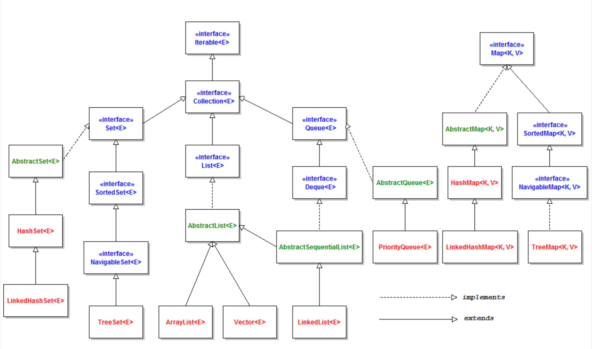

## StudyGuide

 

---

### Java Most Common Data Structures

 

---

### Numpy Vectorization #1
[Nuts and Bolts of NumPy Optimization Part 1: Understanding Vectorization and Broadcasting](https://blog.paperspace.com/numpy-optimization-vectorization-and-broadcasting/)

 

### mean, var, std
- [Blog: var: Why do we use n-1?, std](https://m.blog.naver.com/PostView.nhn?blogId=firerisk&logNo=221252800526&proxyReferer=https:%2F%2Fwww.google.com%2F)

- [Blog: var: Why do we use n-1?](https://jaehoo.tistory.com/entry/%ED%91%9C%EC%A4%80%ED%8E%B8%EC%B0%A8%EC%97%90%EC%84%9C-n-1-%EC%93%B0%EB%8A%94-%EC%9D%B4%EC%9C%A0)

 

---

### DFS
 
 

- No back edge = No Cycle
- DFS w/o cycle => Topological ordering
    - Graph into linear ordering 
    - repects "dependency"

 

---

 

### BFS

 

 

#### Dijkstra's Algorithm

>Google map : Shortest path from A to B

 

#### Prim's Algorithm

> - minimum spanning tree
>    - cost for connection each potential nodes in network 
>    - What's the cheapest way to get all computers connected?
