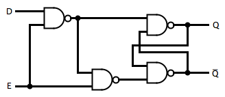
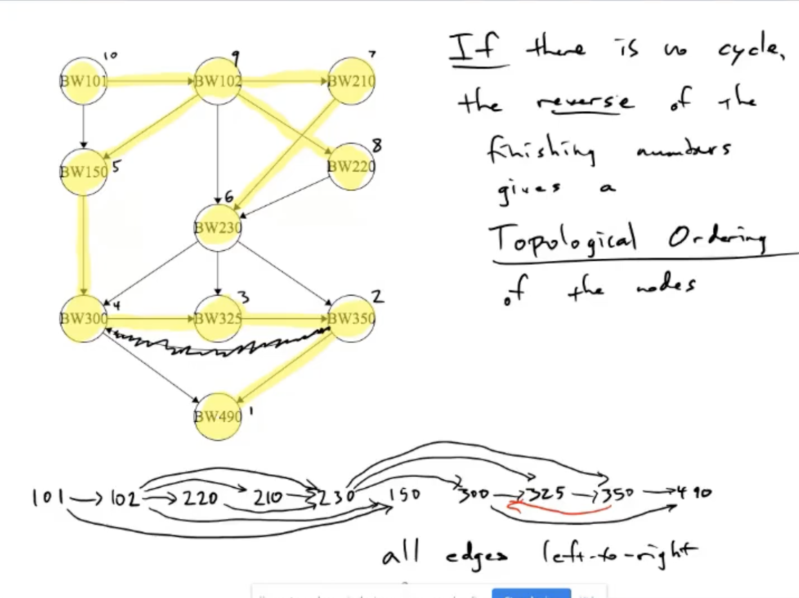

# StudyGuide

 

---

## Languages
- alphabet: finite, non-empty set.
- symbols: elements of the set.
- string: finite sequence of symbols from an alphabet

> Example: Σ = {0,1} is an alphabet, and 011, 1010, and 1 are all strings over Σ.

### String Operations
- length: ∣x∣
- concatenation: xy or x⋅y
    - associative: (xy)z = x(yz)
    - not commutaive: xy != yz
- reversal: x^R
 
### Empty String
- ε or λ
- ∣ε∣ = 0
- ε^R = ε
- ε⋅x = x⋅ε = x (for all string x)

### Σ*
- set of strings made up of zero or more symbols from Σ
- Σ : finite, Σ^* : infinite

> If Σ = {a,b}, then Σ^* = {ε,a,b,aa,ab,ba,bb,aaa,aab,…}.

### Definition of a language
language over an alphabet Σ

= subset of Σ^* 

= element of P(Σ^\*) = power set of Σ^\* 

### Kleene closure 
- two set of strings S and T: ST={st ∣ s ∈ S ∧ t ∈ T} 
- S2 = set of all strings formed by concatenating two strings from S.
- Kleene closure S*: S0 ∪ S1 ∪ S2 ∪…
- * operator: Kleene star operator

 

---

## Regular Expressions
- word = string = sequence of symbols from an alphabet
- formal language != human language (structural rules)
    - alphabet in FL == words in HL
    - words in FL == sentences in HL

- Regex: way of describing the grammatical structure of the strings
    - can be "mechanically" described or generated
    - computer can recognize strings

- L(r): language generated by a regular expression r

 

---
## Finite-State Automata
- input: finite string of symbols 
- Finite set of states
- Start state / Accepting / Final
- transition function: specifies what happens if the machine is in a particular state and looking at a particular input symbol

 

---

## DFA: Deterministic Finite-State Automata
- For every <current state, current input symbol> pair, there is exacly one possible nest state

> δ (transition function): δ*(q, w) == result state when in state q, input w
> δ*(q, ε) = q

- Accepting & Non-accepting states

Accepting
> Language L is accpeted by some machine M iff L = L(M) -> don't mean that L and maybe some other strings are accepted by M

Non-accepting 
>garbage, error, trap state

 

---
## NFA: Nondeterministic Finite-State Automata
- FSA with multiple input/ no input(ε-transition)? -> DFA does not work

> NFA: DFA + state-ε pair. (maps state input pair & stateε pair)
> ∂(q,a) = {q1, q2, ... ,qn} : might move to one of the states, original state q, input a.

- Accepting & Non-accepting states
> A string w is accepted by an NFA provided that at least one of the states in ∂ *(q, w) is an accepting state

 

---
## NFA and DFA
> NFA = super set of DFA. vice versa?
> 
> for any NFA, we can find DFA that accepts the same language.

For example

>NFA

>partially contructed DFA

 

---
## Finite-State Automata & Regular Languages

Regex to NFA
> [Every Regex can be recognized by NFA](https://bhoward.github.io/focsipedia/docs/lang/fsareg/) 

NFA to Regex
> Every language accepted by DFA / NFA is genereated by Regex. 

Properies of Regular Language
> - intersection of two regular languages is a regular language
> - union of two regular languages is a regular language
> - concatenation of two regular languages is a regular language
> - complement of a regular language is a regular language
> - Kleene closure of a regular language is a regular language

 

---
## Sequential Circuits
- Sequential logic circuits: circuits with cycles

- Synchronous: clock signal to synchronize the times when feedback is applied

- Asynchronous: feedback arrives as soon as gate delays permit. 

Gated D latch - SR latch with extra layer, D(data) E(enable) as input

flip-flop - clocked device, only respond to input for a very brief time

---

### Java Most Common Data Structures

 

---

### Numpy Vectorization #1
[Nuts and Bolts of NumPy Optimization Part 1: Understanding Vectorization and Broadcasting](https://blog.paperspace.com/numpy-optimization-vectorization-and-broadcasting/)

 

### mean, var, std
- [Blog: var: Why do we use n-1?, std](https://m.blog.naver.com/PostView.nhn?blogId=firerisk&logNo=221252800526&proxyReferer=https:%2F%2Fwww.google.com%2F)

- [Blog: var: Why do we use n-1?](https://jaehoo.tistory.com/entry/%ED%91%9C%EC%A4%80%ED%8E%B8%EC%B0%A8%EC%97%90%EC%84%9C-n-1-%EC%93%B0%EB%8A%94-%EC%9D%B4%EC%9C%A0)

 

---

### DFS
 
 

- No back edge = No Cycle
- DFS w/o cycle => Topological ordering
    - Graph into linear ordering 
    - repects "dependency"

 

---

 

### BFS

 

 

#### Dijkstra's Algorithm

>Google map : Shortest path from A to B

 

#### Prim's Algorithm

> - minimum spanning tree
>    - cost for connection each potential nodes in network 
>    - What's the cheapest way to get all computers connected?
