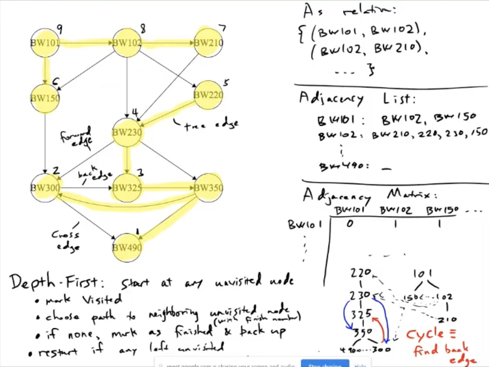
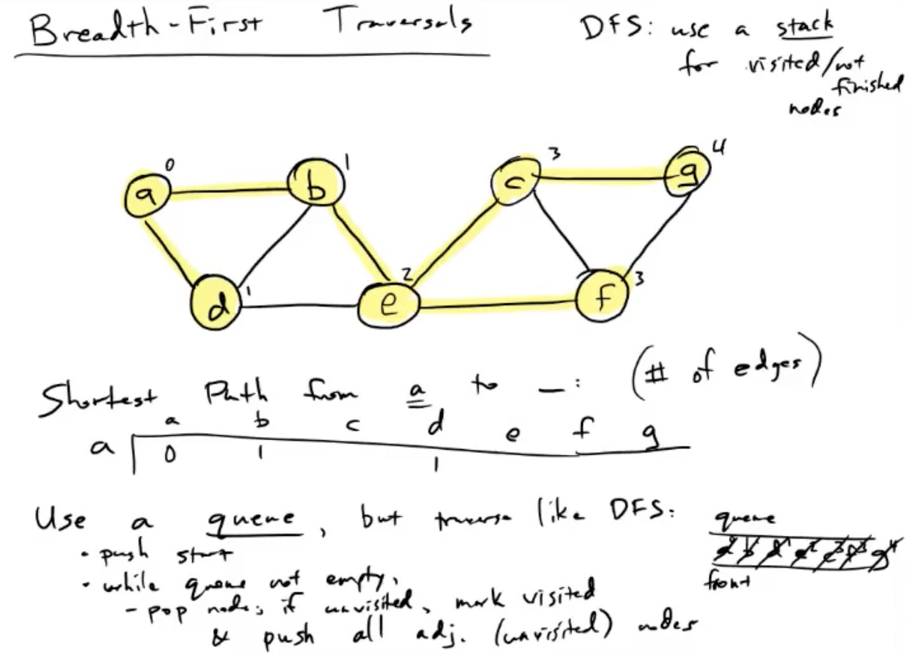
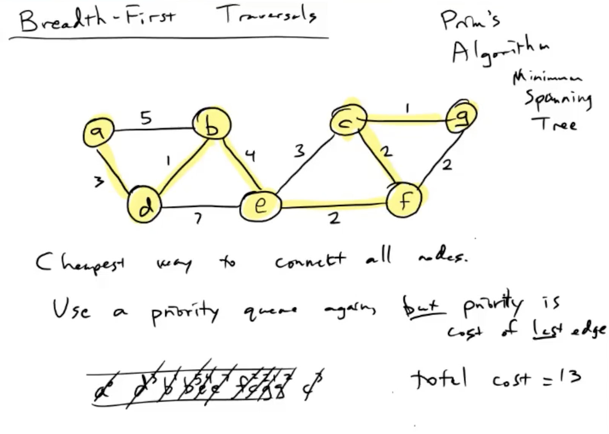

# StudyGuide

 

---

## Languages
- alphabet: finite, non-empty set.
- symbols: elements of the set.
- string: finite sequence of symbols from an alphabet

> Example: Σ = {0,1} is an alphabet, and 011, 1010, and 1 are all strings over Σ.

### String Operations
- length: ∣x∣
- concatenation: xy or x⋅y
    - associative: (xy)z = x(yz)
    - not commutaive: xy != yz
- reversal: x^R
 
### Empty String
- ε or λ
- ∣ε∣ = 0
- ε^R = ε
- ε⋅x = x⋅ε = x (for all string x)

### Σ*
- set of strings made up of zero or more symbols from Σ
- Σ : finite, Σ^* : infinite

> If Σ = {a,b}, then Σ^* = {ε,a,b,aa,ab,ba,bb,aaa,aab,…}.

### Definition of a language
language over an alphabet Σ

= subset of Σ^* 

= element of P(Σ^\*) = power set of Σ^\* 

### Kleene closure 
- two set of strings S and T: ST={st ∣ s ∈ S ∧ t ∈ T} 
- S2 = set of all strings formed by concatenating two strings from S.
- Kleene closure S*: S0 ∪ S1 ∪ S2 ∪…
- * operator: Kleene star operator

 

---

## Regular Expressions
- word = string = sequence of symbols from an alphabet
- formal language != human language (structural rules)
    - alphabet in FL == words in HL
    - words in FL == sentences in HL

- Regex: way of describing the grammatical structure of the strings
    - can be "mechanically" described or generated
    - computer can recognize strings

- L(r): language generated by a regular expression r

 

---

### Java Most Common Data Structures

 

---

### Numpy Vectorization #1
[Nuts and Bolts of NumPy Optimization Part 1: Understanding Vectorization and Broadcasting](https://blog.paperspace.com/numpy-optimization-vectorization-and-broadcasting/)

 

### mean, var, std
- [Blog: var: Why do we use n-1?, std](https://m.blog.naver.com/PostView.nhn?blogId=firerisk&logNo=221252800526&proxyReferer=https:%2F%2Fwww.google.com%2F)

- [Blog: var: Why do we use n-1?](https://jaehoo.tistory.com/entry/%ED%91%9C%EC%A4%80%ED%8E%B8%EC%B0%A8%EC%97%90%EC%84%9C-n-1-%EC%93%B0%EB%8A%94-%EC%9D%B4%EC%9C%A0)

 

---

### DFS
 
 

- No back edge = No Cycle
- DFS w/o cycle => Topological ordering
    - Graph into linear ordering 
    - repects "dependency"

 

---

 

### BFS

 

 

#### Dijkstra's Algorithm

>Google map : Shortest path from A to B

 

#### Prim's Algorithm

> - minimum spanning tree
>    - cost for connection each potential nodes in network 
>    - What's the cheapest way to get all computers connected?
